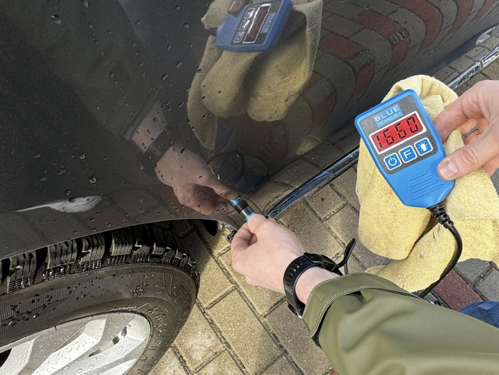
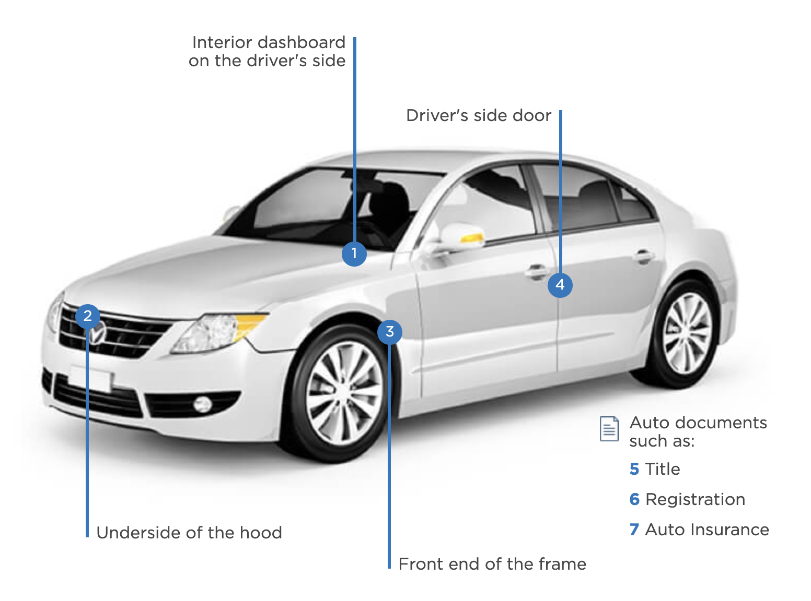
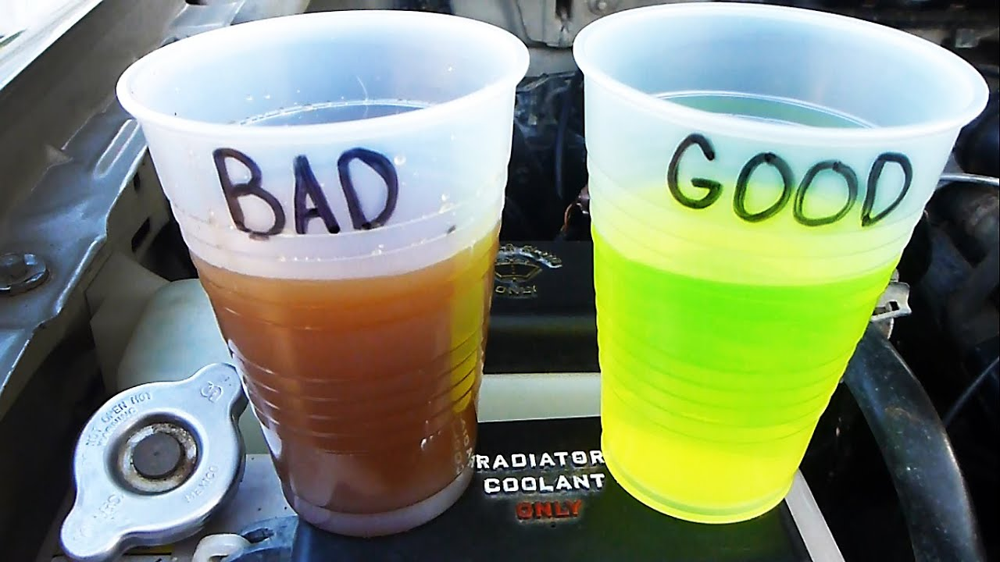
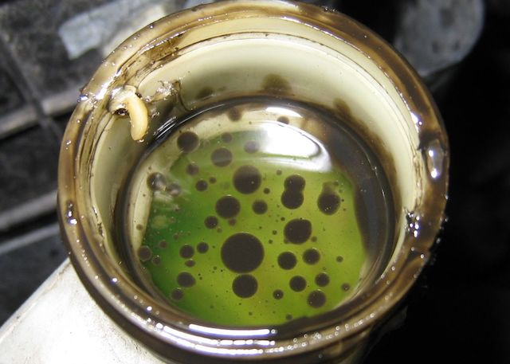
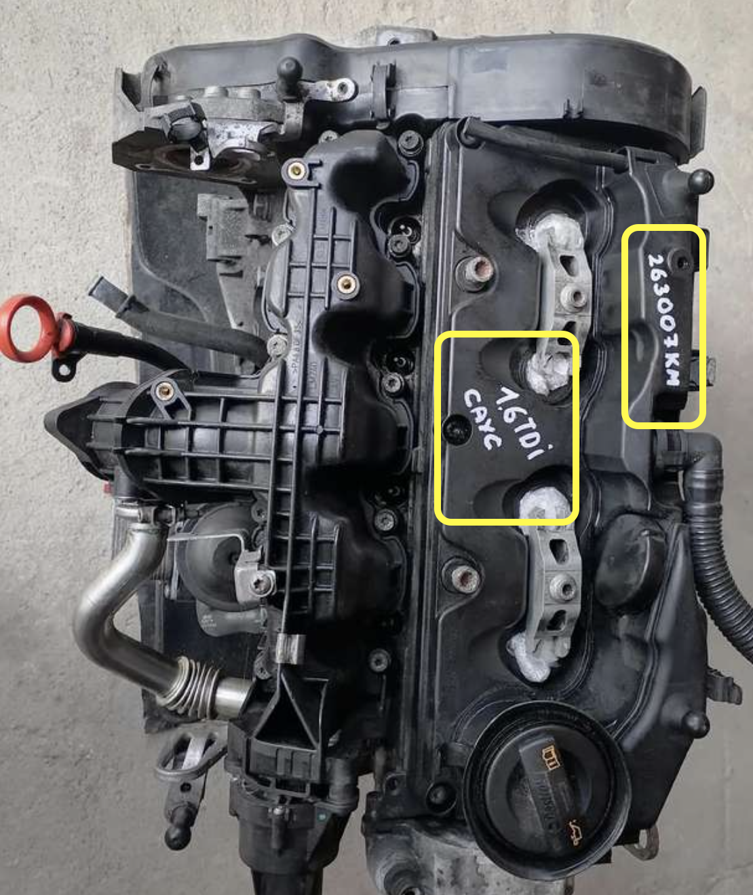
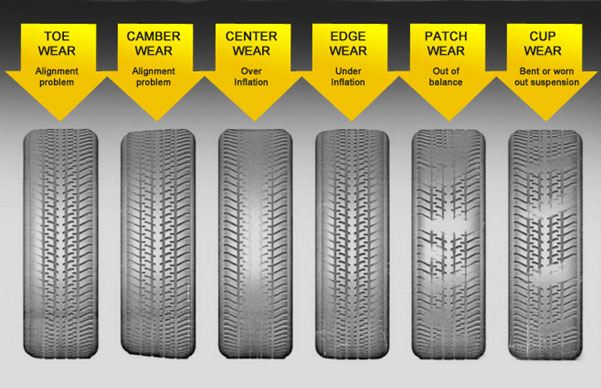
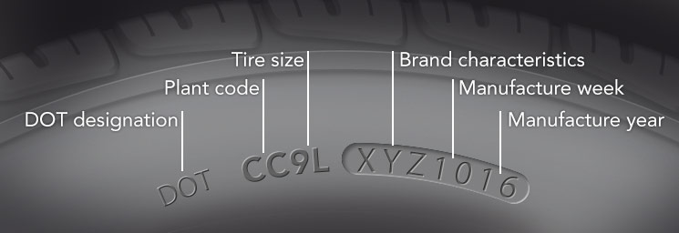
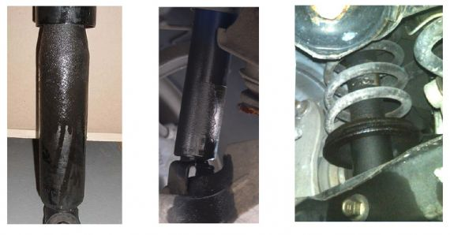
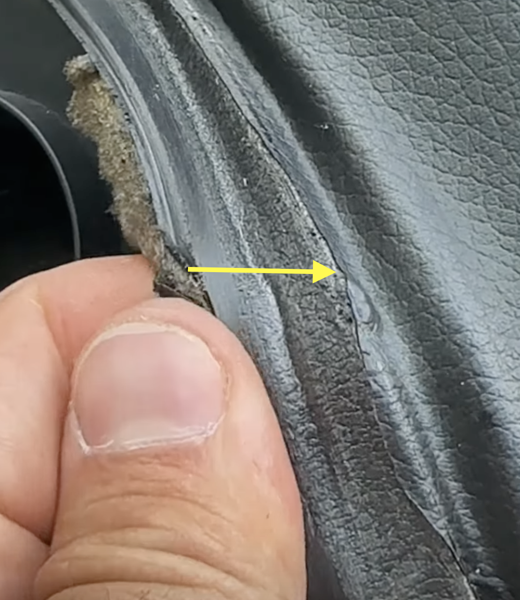

# 📝 Savarankiškos automobilio patikros gidas

_Šis dokumentas ir jame pateikta informacija yra skirta tik informaciniams tikslams ir neturi būti laikoma profesine konsultacija. Autorius neatsako už jokius nuostolius, žalą ar pasekmes, kurios gali kilti naudojantis šia informacija. Visi naudotojai prisiima visą riziką, susijusią su informacijos naudojimu ir jos taikymu praktikoje._

_Prieš priimdami bet kokius sprendimus, susijusius su automobilių apžiūra ar pirkimu, rekomenduojame pasikonsultuoti su kvalifikuotais specialistais. Autorius neatsako už jokius netikslumus, klaidas ar praleidimus šiame dokumente. Naudodamiesi šia informacija, jūs patvirtinate, kad suprantate ir sutinkate su šiuo atsakomybės apribojimu._

---

**TLDR**: Jei rimtai planuojate pirkti automobilį, prieš pirkdami jį **būtinai patikrinkite gamintojo autorizuotame autoservise** arba kitame **savo nuožiūra** pasirinktame autoservise. Kiekviena tokia apžiūra kainuoja, todėl vertėtų prieš tai įsivertinti automobilio būklę savo jėgomis ir taip sumažinti su pirkiniu susijusius kaštus.

---

Dauguma pradedančiųjų (ir ne tik) vairuotojų susiduria su išškūkiais, kuomet ateina laikas įsigyti automobilį. Apmaudu, tačiau ne kiekvienas gali įsigyti naują iš salono, todėl tenka pradėti dairytis į naudotų automobilių skelbimus. Toliau seka ne visada malonios patirtys su automobilių apžiūra ir pirkimu. Žinoma, yra galimybė visą šį darbą patikėti savo srities profesionalams, tačiau tai gali ženkliai padidinti automobilio įsigijimo kaštus.

Dėl šios priežasties kilo mintis paruošti veiksmų ir patarimų sąrašą, kuris galėtų pagelbėti ieškant tinkamo naudoto automobilio. Sąrašas sudarytas remiantis informacija, surinkta iš įvairių šaltinių bei savo žinių, tačiau nėra baigtinis. Vis dėlto, šio turėtų pakakti objektyviai įsivertinti ar automobilis yra vertas jūsų dėmesio ir kelionės į apžiūrą autoservise. Taip pat verta paminėti, kad autoservisai ne visada atlieka visų automobilio mazgų patikras, todėl rekomenduojama patikrinti bent jau įprastas funkcijas, kurios nereikalauja specifinių žinių.

## 📚 Prieš skambutį

Atlikus namų darbus prieš skambutį, galima sutaupyti laiko ir skambučio metu išsiaiškinti, ar dažnai pasitaikančios problemos jau yra pasireiškusios jūsų pasirinktam automobiliui.

- Skirkite laiko ir išsiaiškinkite dažniausias problemas, su kuriomis susiduria jūsų išsirinktas automobilis.
  - [AutoAsas automobilių atsiliepimai](https://autoasas.lt/)
  - Facebook automobilių markės grupės
  - [Info apie automobilius, degalų suvartojimą ir pan.](https://www.car.info/)
- Pasidomėkite, ar automobilis linkęs rūdyti. Jei taip, kokiose vietose.
- Jei automobilis iš JAV, būtinai patikrinkite VIN kodą naudodami [Google](https://google.com), [Bing](https://bing.com) ir [BidHistory](https://en.bidhistory.org/) paieškos tinklapius. Tikėtina, jog rasite originalias automobilio nuotraukas pieš atvykstant į Lietuva.

## 📞 Skambučio metu

Klausimai ir faktai, kuriuos verta išsiaiškinti pirmo skambučio metu:

- Paklauskite, kodėl parduodamas automobilis?
- Išsiaiškintike, ar pardavėjas yra automobilio savininkas?
- Kokie yra automobilio defektai?
- Ką vertėtų žinoti prieš atvykstant apžiūrėti automobilį?
- Iš kur automobilis parvežtas, jei ši informacija nenurodyta?
- Su kokiomis problemomis automobilis grįžo? Ar yra nuotraukų?
- Kiek laiko automobilį turėjo? (porą mėnesių ar mažiau, tai gali reikšti, kad tai yra perpardavėjas, arba kad jis pats nusipirko automobilį be tinkamo įvertinimo ir dabar bando atsikratyti.)
- Ar automobilyje buvo rūkoma?
- Ar automobilis buvo dalyvavęs avarijose?
- Ar buvo keista variklio grandinė ar diržas? Ar turite tai įrodančias sąskaitas? (Pačiam keisti nėra pigus malonumas)
- Kas kiek kilometrų buvo keičiamas tepalas? Kiek tepalo reikia papildyti tarp keitimų? (Gali paaiškėti, jog variklis smarkiai degina tepalą)
- Jei automobilyje mechaninė pavarų dėžė, paklauskite, kokia sankabos būklė, ar buvo keista sankaba ir kada? Ar nebarška smagratis? Kitos susijusios dalys? Ar turi įrodančias sąskaitas.
- Jei automatinė pavarų dėžė, klausti ar nesmūgiuoja važiuojant? Ar buvo ir kada keisti tepalai?
- Pasiteiraukite dėl korozijos, ypač žinomose židiniuose.
- Ar yra dviejų raktelių komplektas? (Papildomas raktelis dažniausiai kainuoja nuo 300eur)
- Ar yra kablys? (Kablio naudojimas gali prisidėti prie variklio resurso sumažėjimo)
- Ar yra žieminių/vasarinių padangų komplektas?
- Ar yra atsarginis ratas? Putos?
- Ar būtų galimybė automobilį patikrinti autoservise?
- Ar yra galimybė derėtis dėl kainos?
- Ar pirkimo-pardavimo sutartyje bus nurodoma pilna kaina?

  Pasitaiko atvejų, kai automobilių pardavėjai reikalauja nurodyti kitą sumą sutartyje, likus tik sudėti parašus ant pirkimo dokumentų. Tai pastato pirkėją į labai nepatogią poziciją, nes tokiu atveju pirkėjas jau yra investavęs laiko ir pinigų į automobilio patikras. Todėl labai svarbu išsiaiškinti, ar jūsų nelaukia toks siurprizas.

## 🛒 Prieš patikra turėti

Daiktai, kuriuos verta turėti vykstant į automobilio apžiūra priklausomai kiek esate pasiryžę savarankiškai gilintis į automobilio būklę:

1. Servetėlės
2. Vienkartinės/darbinės pirštinės
3. Dezinfekcinis skystis
4. Žibintuvėlis
5. [Padangų protektoriaus storio matuoklis](https://www.autoaibe.lt/irankiai/matavimo-prietaisai-ir-irankiai~309/nn-protektgylio-matuoklis-s159384.html)
6. [Veidrodėlis su teleskopine lazdele](https://www.autoaibe.lt/irankiai/mechaniniai-irankiai/kiti-mechaniniai-irankiai~365/yato-yt-0660-teleskopinis-veidrodis-50x90-mm-ilgis-285-770mm-s227783.html#locations)
7. [Dažų storio matuoklis](https://eprekyba-lt.intercars.eu/produktai/F8BD8A-dazu-storio-matuoklis-blue-technology-0xdx-13-s-al)
8. [OBD2 skaitytuvas](https://www.iamcarhacker.com/car-scanner-app/), [OBDEleven🇱🇹](https://obdeleven.com/products)

## 🩺 Automobilio patikra

Patikra buvo padalinta į dvi dalis, siekiant sutaupyti abiejų proceso dalyvių laiką. Pirminė apžiūra yra labiau paviršutiniška, trunka trumpiau ir turėtų padėti nuspręsti, ar verta gilintis į automobilį ir atlikti antrinę patikrą, kuri gali užtrukti ilgiau. Atlikus abi patikras ir nusprendus, kad automobilis jums tinka, labai rekomenduojama atlikti profesionalią patikrą gamintojo specializuotame autoservise.

### 🟢 Pirminė

1. **Dokumentai:**

   1. Techninės patikros istorija: [Tuvlita](https://itais.vta.lt/itais/services/search)
   2. Patikrinti ar nėra kokių ribojimų: [Regitra](https://www.eregitra.lt/services/vehicle-registration/data-search)
   3. Patikrinti VIN ir kitus deklaruotus duomenis.
   4. Papildomi dokumentai - ekspertizės ir pan.
   5. Įsitikinti ar automobilį parduoda savininkas.
   6. Patikrinti ridą ant dokumentų ir automobilio.

2. **Kėbulas:**

   1. Apeikite ratą aplink automobilį, kad įvertintumėte jo bendrą būklę.
   2. Pastebėkite įbrėžimus, įlenkimus, įdaužas ir pan.
   3. Tikrinkite tarpus tarp kėbulo dalių (tarp kapoto ir sparnų, tarp sparnų ir durelių, tarp priekinių ir galinių durelių, tarp bagažinės dangčio ir sparnų). Paprastai jie turėtų būti lygūs. Galima vesti pirštu per tarpus ir bandyti pajausti ar nėra nesutapimų. Siaurus kėbulo tarpus galima patikrinti paprasta kortele ar visur praeina vienodai.
   4. Žibintų būklė (skilimai, rasojimas, pageltimas). Patikrinkite, ar automobilio priekiniai žibintai yra vienodi, t. y. to paties gamintojo (žymėjimai, gamintojas ir pan.), ir ar jie yra vienodai susidėvėję. Tai gali atskleisti, kad žibintai buvo keičiami dėl įvykio.
   5. Stiklo įtrūkimai, įdaužos.
   6. Patikrinkite kėbulą naudodami [dažų storio matuoklį](https://eprekyba-lt.intercars.eu/produktai/F8BD8A-dazu-storio-matuoklis-blue-technology-0xdx-13-s-al), nepamirškite stogo:

      - **Iki 70 μm – plonas dangos storis (galimai nudažyta be grunto, poliruota)**
      - **80 – 200 μm – originalus dangos storis** ⇐ GERAI
      - 200 – 300 μm – dalis perdažyta (antras dažymas) ⇐ **Antras dažymas - BLOGIAU**
      - 300 – 520 μm – dalis po remonto (tiesinimas +2 sluoksniai dažų) ⇐ **BLOGAI**
      - 520 – 750 μm – paviršius po glaistymo ir dažymo (glaisto storis apie 0,5 mm) ⇐ **LABAI BLOGAI**

      _Jei buvo atlikti dažymo darbai, svarbu išsiaiškinti, kada tai vyko, geriausia turint įrodymus. Tai padės įvertinti, ar galėjo praeiti pakankamai laiko, kad išryškėtų nekokybiškai atlikto darbo pasėkmės._

      

   7. Įvertinti slenksčius ir dugną dėl korozijos, (galima naudoti kilimėlį iš auto). Patikrinkite pakėlimo vietas, pačiupinėti iš vidaus, kad įsitikinti ar nėra surudiję.
   8. Patikrinkite apačia iš galo, kur dažniausiai labiausiai būna pažeista korozijos.
   9. Pažiūrėti iš priekio po automobiliu ar nesimato tepalo nuotekio. Ar yra visos apsaugos, tvirtinimai, ar viskas gerai laikosi.
   10. Patikrinkite ar nėra korozijos židinių po slenksčiais ar posparniais.
   11. Patikrinkite VIN ant kėbulo

       

3. **Variklio skyrius:**

   1. Jei variklis yra apdulkėjęs, tai yra labai geras ženklas. Tikėtina, kad pardavėjas nesuinteresuotas slėpti tepalo nuotekio. Jei variklis buvo plaunamas, gali būti, jog bandoma nuslėpti tepalų praleidimą.
   2. Patikrinkite sparnų varžtus, ar bus sukinėti. Galėtų reikšti keistas dalis.
   3. Patikrinkite variklio tvirtinimo varžtus, ar buvo sukinėti. Tai gali parodyti ar buvo keistas, iškeltas variklis.
   4. Įvertinkite aušinimo skysčio (antifryzo) spalvą. Paprastai spalva turi būti ryški. Rusva ar drumsta spalva reiškia seną antifrizą. Tačiau po tuo gali slypėti ir rimtesnės problemos, susijusias su korozija. **Nepamiršti pasižymėti koks antifrizas yra naudojamas.**

      

   5. Ar nėra tepalo aušinimo skysčio bakelyje. Jei yra, tai tuomet gali reiškti, jog variklio galvos tarpinė/galva galimai trūkusi, kas reikštų dideles išlaidas remontui.

      

   6. Įvertinkite aušinimo skysčio lygį. Jei mažai, kodėl? Galbūt kažkur leidžia.
   7. Patikrinkite tepalo dangtelį, ar ant jo nėra kokios košės. Šviesi košė susidaro dėl antifrizo patekusio į variklio vidų. Vėl, reikštų pažeidimą variklio galvos tarpinėje/galvoje. Tamsi košė tikėtina atsirado dėl "[daktaro](https://ic24.lt/produktai/BDFB93-variklio-alyvos-priedas-moje-auto-ma-19-067)" panaudojimo.

      

   8. Patikrinkite tepalo lygį. Pasiruošti servetėlę iš anksto. Jei lygis yra mažas ir ant benzino, tai tikėtina, jog degina tepalą, jei dyzelis, tai tikėtina, jog leidžia arba taip pat degina.
   9. Atkreipti dėmesį į ne gamintojo originaliai pažymėtas dalis, kurios gali būti iš šroto.

      

   10. Įvertinkite radiatoriaus būklę, ar nėra pažeidimų, skysčio praleidimo.
   11. Patikrinkite stabdžių skystį ar pilnai užpildytas. Jei juodas kaip tepalas, reiškia buvo labai senai keistas.
   12. Užvesti variklį ir pasiklausyti variklio darbo. Atkreipti dėmesį į pašalinius garsus.

4. **Važiuoklė:**

   1. Pasukus vairą įvertinti padangų protektoriaus gylį. Atkreipti dėmesį ar nėra nusidėvėjimo vienoje pusėje ir ar kraštai nudilę vienodai. Asimetrija bylotų, jog yra blogas suvedimas, kurį reikia atlikti. Papildomos išlaidos, dėl kuriu reiktų derėtis.

      

   2. Įvertinkite padangų būklę ir amžių. Padangų, pagamintų iki 2000-ųjų, pagaminimo metai nurodomi vienu skaitmeniu (pvz., 189 reikštų 18-a savaitė, 1999).  Paprastai >10 metų padangas rekomenduojama keisti, tačiau reiktų tikrinti gamintojo rekomendacijas.

      

   3. Įvertinkite stabdžius ir su pirštu patikrinkite, ar nėra disko [lūpos](https://www.prekesvisiems.lt/stabdziu-disku-nuozulu-nuemejo-rinkinys-3vnt), nes diskas neturėtų turėti lūpos. [Video](https://www.youtube.com/@wayofthewrench)
   4. Patikrinkite amortizatorius, ar nėra apsitepalavę. Jie turėtų būti sausi.
   5. Įvertinkite, kaip atrodo spyruoklės. Jei jos yra parūdijusios, yra tikimybė, kad žiemą gali sulūžti.
   6. Bandyti paliesti "štoką", kad patikrinti ar ant jo nėra drėgmės/depalo. [Instrukcija](https://vehicleinspection.nzta.govt.nz/virms/in-service-wof-and-cof/tb-general/shock-absorbers)

      

   7. Patikrinkite amortizatoriaus apsauginę gumą, ar nėra įplyšimų. Jei tokių yra, tikėtina, kad, nors šiuo metu viskas gali būti gerai, netolimoje ateityje tai gali sugadinti amortizatorių.

5. **Salonas:**

   1. Įvertinti bendrą būklę. Nepamiršti lubas.
   2. Atkreipti dėmesį į sėdynių nusidėvėjimą, defektus.
   3. Pedalų būklė gali atspindėti ridą, jų nusidėvėjimas.
   4. Patikrinti kondicionierių (net žiemą). Įjungus turėtų sukilti variklio apsukos.
   5. Patikrinti pečiuką.

6. **Bandomasis važiavimas:**

   1. Įjungti degimą ir nuskaityti klaidas su automobiline diagnostika ([ODBEleven](https://obdeleven.com/products) ar kita, kuri palaiko OBD2 protokolą). Atkreipti dėmesį į **Pending** klaidas, kurios reiškia, kad buvo šviežiai ištrintos klaidos. Išsisaugoti sąrašą. Ištrinti prieš važiavimą, jei yra klaidų (gavus savininko sutikimą).
   2. Patikrinti ar automobilio kompiuterio (ECU) VIN kodas sutampa su kėbulo.
   3. Patikrinti rankinį stabdį jį įjungus ir bandant pajudėti iš vietos.
   4. Automatinė pavarų dėžė:
      - Norint patikrinti ar automatinės pavarų dėžės [puslė](https://rrr.lt/autodaliu-katalogas/pavaru-deze-sankaba-transmisija/sankaba/apd-hidro-transformatorius-automato-pusle) yra geros buklės, įjungiama **D** pavara ir atleidus stabdį, automobilis turėtų pradėti riedėti.
      - Prasidarius langą, perjungti pavaras iš R į D ir klausytis ar nėra jokių pašalinių garsų.
      - Jei yra mechaninis režimas automatinėje greičių dėžėje, derėtų ranka pabandyti perjungti bėgius.
      - Pabandyti lėtai važiuojant įvertinti, kaip junginėja bėgius, tuomet greitai startuojama. Dėžė neturėtų užlaikyti kuomet perjungiamos pavaros, neturėtų jaustis lyg būtų pristabdoma prieš perjungiant. Jei kyla apsukos, tačiau niekas nevyksta, tai tuomet tikėtina, jog pavarų dėžė yra blogos būklės.
   5. Mechaninė pavarų dėžė:
      - Išminkite sankabą ir po truputį atleisdami stebėkite kada ji pradeda griebti. (kuomet pradeda gesti automobilis, tuomet sankaba griebia)
      - Jei atrodo , jog sankaba griebia silpnokai, tokia prie viršaus (beveik pilnai atleidus pedalą), tuomet jungiam antrą bėgį ir bandom startuoti lyg su pirma pavara. Jei rezultatas panašus, kaip kad naudojant pirmą pavarą, tuomet sankaba gera.
      - Jei vis dar yra įtarimų, kad sankaba yra blogos būklės, tuomet reikia įjungti trečią pavarą ir visiškai atleisti sankabą. Jei automobilis neužgęsta, tai rodo, kad sankaba yra labai nusidėvėjusi.
   6. Važinėjant po aikštele ir atidarius langą, pilnai pasukite vairą į vieną pusę, o tada į kitą. Taip tikrinamos granatos, ar nėra pašalinių garsų. Taip pat gali pasireikšti vairo stiprintuvo garsai (cypimas).
   7. Pervažiuoti specialiai per duobes arba gulinčius policininkus, atidžiai klausantis, ar nėra akivaizdžių bildėjimų ar kitų pašalinių garsų.
   8. Patikrinkite stabdžius, ar jie nėra 'guminiai', ar stabdant nesijaučia vairo drebėjimo, mušimo ar kitų nepageidaujamų reiškinių.
   9. Pravažiuoti ~100km/h greičiu:
      - Gali atsiskleisti guolių ūžimas, ypač darant posūkius.
      - Pasitaiko vairo drebėjimai, dėl ratų nesubalansavimo. Gali būti tiek balansas, tiek patys ratlankiai.
      - Jei variklis dyzelinis, tuomet tai gali padėti išsiaiškinti turbinos darbą. Reikia duoti pilną gazą ir vertinti kaip veikia turbina. Geriausia nuo 3 pavaros. Jei automobilis netraukia, nesigirdi turbinos, tuomet labai tikėtina, kad turbina yra blogo stovio.
      - Važiuojant lygiu keliu lengvai šiek tiek paleisti vairą ir stebėti ar automobilio nenešą į kažkurią pusę.
   10. Patikrinkite autopilotą. Jei neveikia, gali būti brangus remontas.
   11. Po pravažiavimo, patikrinkite ar nėra tepalo praleidimo/varvėjimo.
   12. Po važiavimo nuspausti įvairius mygtukus ant skydelio, multimedija, radija ir pan, kurie gali iššaukti klaidas, kurias vėliau atskleistų diagnostika.
   13. Pakkartotinai nuskaityti sistemos klaidas su automobilio diagnostika.

### 🟡 Antrinė

1. **Kėbulas:**

   - Patikrinkite posūkius ar šviečia oranžine spalva vietoj raudonos (amerikietiški).

     

   - Posparnių tvirtinimas, originalūs ar ne.
   - Patikrinkite stiklų gamintoją ir žymėjimus, ar ant visų sutampa.
   - Patikrinkite kėbulo plastikines dalis (apsaugas, durelių rankenas ir panašiai), ar ant jų nėra matomų dažymo žymių, kurios galėtų rodyti prastą maskavimą dažymo proceso metu. Tai būtų aiškus ženklas, kad remonto kokybė nebuvo prioritetas.
   - Patikrinkite iš vidinės pusės su veidrodžiu, ar buferis nebuvo lituotas.
   - Atsidarius dureles, pasitikrinkite, ar nėra spalvos skirtumo tarp kėbulo ir durelių tarpo.
   - Pradarius dureles, patikrinkite, ar nėra rūdžių židinių. Nepamirškite patikrinti ir po gumomis.
   - Atidarius bagažinę, patikrinkite dalis, kurios paprastai nėra matomos. Pakelkite dangčius ir ieškokite korozijos židinių bei suvirinimo žymių.
   - Užrakinus automobilį, patikrinkite, ar visos durys tikrai yra užrakintos. Taip pat, atrakindami automobilį, įsitikinkite, ar visos durys atsidaro.

2. **Variklio skyrius:**

   - Užvedus variklį, atsukite tepalo dangtelį ir stebėkite, ar jis nešokinėja. (Gali išduoti problemas su variklio [alsuokliu](https://autozinios.lt/kokia-yra-variklio-alsuoklio-paskirtis/)). Užsikimšęs variklio alsuoklis gali privesti prie tepalo leidimo pro variklio galvos tepalo dangetelio tarpinę.
   - Atkreipkite dėmesį, ar aplink tepalo dangtelį nėra tepalo dėmių. Jei variklis degina tepalą, tikėtina, kad dažniau reikės papildyti jo kiekį, ir neretai pasitaiko, kad šiek tiek tepalo išsilieja šalia.
   - Jei naudojami dirželiai, būtina įvertinti jų būklę. Grioveliai išorinėje pusėje rodo dirželio amžių: kuo mažiau nutrinti, tuo geriau.
   - Jei automobilis yra dyzelinis, patikrinkite, ar aplink purkštukus nėra dyzelio ar tepalo nuotėkio. Taip pat įsitikinkite, ar purkštukai nebuvo keičiami ar sukti.
   - Jei kondicionierius neveikia, pirmiausia reikėtų patikrinti, ar kondicionieriaus sankabėlė tinkamai prisitraukia. Gali būti, kad laidai yra nutraukti. Taip pat svarbu įsitikinti, ar pati sistema nėra pažeista. Tai galima padaryti atsukus freono užpylimo angą ir nuspaudus vožtuvėlį.
     ⚠️ **Freonas yra nuodingas**, todėl reiktų pasisaugoti jo ir prieš nuspaudimą atsitraukti. Taip pat jis turėtų būti žalios spalvos skystis. Jei leidžia orą, tuomet gali būti užpildyta tik pardavimo tikslams.
   - Patikrinkite priekines lempas, ar jos pagamintos Europos Sąjungoje..

3. **Važiuoklė:**

   - Patikrinkite lietus ratus iš kitos pusės su veidrodžiu ir žibintuvėliu, jog jie nėra skilę ar virinti.

4. **Salonas:**

   - Įvertinkite viską: rankenėles, sėdynes (ar jos nenusėdėtos), lubas (ar jos sveikos, be pažeidimų).
   - Patikrinkite diržo sagtis ir ar saugos diržai tinkamai fiksuojasi.
   - Patikrinkite puodelių laikiklius, daiktadėžę ir porankius.
   - Patikrinkite galvos atramas.
   - Patikrinkite stoglangį ir jo funkcijas, jei toks yra.
   - Patikrinkite, ar panelė nebuvo ardyta, ir atidarymo žymes prie tarpų. Taip pat, įsitikinti ar panelę nebuvo perklijuota siekiant nuslėpti avarijos padarinius.

     

   - Patikrinkite visus jungiklius/mygtukus, radiją, posūklius, valytuvus ir pan.
   - Patikrinkite langų apipurškimą.
   - Patikrinkite galinį valytuvą, jei toks yra.
   - Patikrinkite garso signalą.
   - Pilnai nuleiskite ir pakelkite visus langus.
   - Patikrinkite ar iš kiekvieno ortakio pučia oras.
   - Patikrinkite partronikus.
   - Patikrinkite sėdynių šildymą.
   - Pakartotinai nuskaitykite sistemos klaidas.

## ⚠️ Svarbu

- Automobilio kėbulo būklė yra labai svarbus ir kertinis parametras. Dėl avarijos prarastos geometrijos atstatymas gali kainuoti brangiau nei pats automobilis.
- Išsiaiškinti, ar variklis naudoja grandinę, ar diržą. Grandinė (atlaiko apie 250k) - metalinis gaubtas, dalys nesimano; diržas (atlaiko apie 100k) - plastmasinis gaubtas.
- Benzininiai varikliai su rida +250k gali pradėti deginti tepalą. Priežastys gali būti įvairios: sudilę žiedai, retai keisti tepalai, gamintojo klaidos (_2.0L TFSI_).
- Nerekomenduojama įsigyti automobilį su "[roboto automatine dėže](https://www.pavarudezes.lt/naudinga-informacija/robotizuotos-pavaru-dezes/)".
- Serviso patikros metu paprašyti nuotraukų, kurios parodytų kokia situacija po automobilio apačia. Taip pat fotografuoti tepalo leidimo žymes.

## 🔍 Informacijos paieška

### VIN kodo tikrinimas

- Carvertical
- https://www.carfax.eu/
- [AutoDNA](https://www.autodna.de/)
- https://web.vinwiki.com/#/login
- https://en.bidhistory.org/

### Kita informacija

- [Ieškoti informacijos pagal savininko deklaravimo kodą (SDK)](https://www.eregitra.lt/services/vehicle-declaration/info-by-owner-declaration-code-search)
- [Tuvlita APŽIŪROS GALIOJIMAS IR ISTORIJA](https://itais.vta.lt/itais/services/search)
- [Informacija apie Volvo automobilį pagal VIN](https://www.volvoautodalys.lt/)
- [Details by VIN](https://www.searchquarry.com/)
- [Car parts by VIN](https://www.parts-catalogs.com/eu/demo/#/carInfo?q=YV1DZ73CDE2577663)(region, engine, gearbox, etc, depends on vehicle)
- [AutoAsas automobilių atsiliepimai](https://autoasas.lt/)
- Facebook automobilių markės grupės
- https://vag-codes.info/
- [Info apie automobilius, degalų suvartojimą ir pan.](https://www.car.info/)
- https://en.bidhistory.org/

## 🗃️ Šaltiniai ir nuorodos

- [Skirtingų dalių aprašymai](https://www.vaziuokle.lt/naujienos/)
- [Perkame auto: ką reikia žinoti, kad neliktume prigauti](https://www.youtube.com/@GazasDugnasTV)
- [Kaip apžiūrėti automobilį prieš perkant ir nepakliūti į perikūpų pinklęs](https://www.youtube.com/watch?v=emUi77jNOuo)
- [AR AUTOMOBILIS BUVO DAUŽTAS? 5 BŪDAI KAIP PATIKRINTI! BŪTINA ŽINOTI PRIEŠ PERKANT AUTOMOBILĮ](https://www.youtube.com/@urmokaina2483)
- [Kaip patikrinti perkamo automobilio kondicionierių](https://www.youtube.com/@autopatikra5218)
- [Mokymosi medžiaga](https://vavm.lt/galeriju-katalogas/galerija-4/)
- [4 things you MUST check before you buy any used car! CAR WIZARD shows how not to be scammed!](https://www.youtube.com/watch?v=XlTA5Laa48o)
- [How to Check Used Car Before Buying - DIY Inspection](https://www.youtube.com/watch?v=Rks40ng2C2Y)
- [How to Inspect a Used Car for Purchase](https://www.youtube.com/watch?v=vC8LbvYk6es)
- [Used Car Buying Inspection Checklist - Red Flags - How to Inspect a Used Car and Not Get Scammed](https://www.youtube.com/watch?v=5TBaYEbhd3I)
- [How to Check and Test Your Coolant/Antifreeze](https://www.youtube.com/watch?v=mHTM3dvpD1M)
- [Automobilių patikros/sertifikacijos gidas (In-service certification)](https://vehicleinspection.nzta.govt.nz/virms/in-service-wof-and-cof/general)
- [EASIEST WAY to check “pcv system” (audi, volkswagen) 2.0t](https://www.youtube.com/watch?v=Q3MmILk9A8M)
- [CCTA 2.0TSI OIL SEPARATOR/ PCV FAILURE](https://www.youtube.com/watch?v=H25EZctQ4mM)
